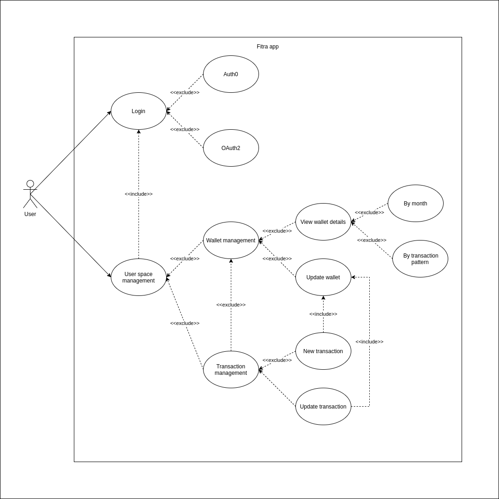

# fitra
Financial tracking

> Pet project

## Documents
### Requirements
- [Requirement docs](./README_Requirements.md)
### Use case diagram
- 

## Aims
- Personal use
- Learn
  - Front-end development: HTML, Javascript, VueJS
  - Back-end techniques
    - Authentication: OAuth2
    - Authorization: ABAC (ORY Keto)
    - Database partition
    - Tools & libraries: ents (ORM), fiber (HTTP Framework),...
  - [Coding style](https://threedots.tech/post/ddd-cqrs-clean-architecture-combined/?utm_source=github.com)
    - Domain-driven design
    - CQRS
    - Clean/Hexagonal Architecture